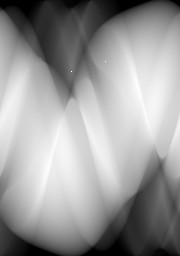
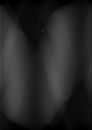

# inpainting

## Introduction

Our goal is to perform an inpainting for computer tomographic images to reduce the dose a patient has to undergo during the examination. We take advantage of recent developments in the architecture of neural nets and utilize so called deep convolutional generative adversarial neural nets.

## Literature
[Semantic Image Inpainting with Deep Generative Models](https://arxiv.org/abs/1607.07539 "Link to arXiv")
[Unsupervised Representation Learning with Deep Convolutional Generative Adversarial Networks](https://arxiv.org/abs/1511.06434 "Link to arXiv")
