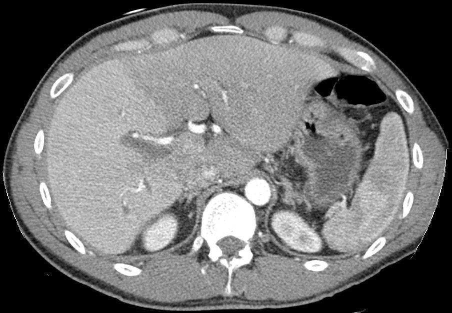

# Inpainting

## Introduction

Our goal is to perform an inpainting for computer tomographic (CT) images, to reduce the dose a patient has to undergo during an examination. We take advantage of recent developments in the architecture of neural nets and utilize so called deep convolutional generative adversarial neural nets (DCGANs) as well as an autoencoder which is trained in an adversarial fashion.

### Radon Transforms

Radon transforms are images as one obtains them from CT scans before the reconstruction. Figure 1 shows a reconstructed CT scan in the axial plane of a patient.

 
<figure>
  

  <figcpation>Fig. 1: Reconstructed CT Scan of a Liver. [<a href="#1">1</a>]</figcaption>
</figure>
  

Before the reconstruction, an image rather has the shape of many stacked sine functions. This typical appearance, as seen below, results from the detector and the x-ray source which rotate around the patient. 

 
<figure>
  

  <figcaption>Fig. 2: (Left) Section through randomly simulated ellipses. (Right) Radon transform of these ellipses.</figcaption>
</figure>
  

The shown radon transform is the result of transforming a simulated section through randomly created ellipses. For a proof of concept we stick to these simulated sections before applying the algorithm to real patient data.

### Dose Reduction
In order to reduce the radiation, a patient has to undergo, one can simply reduce the number of projections. An example of a radon transform with a reduced number of projections is shown in figure 3.

 
<figure>
  

  <figcaption>Fig. 3: Radon transform with less projections.</figcaption>
</figure>
  

To compensate for the reduced information that one obtains from such a radon transform, we test two methods for inpainting the unkown regions.

## Methods

## Literature
[<a name="1">1</a>] [Liver CT Scan](https://upload.wikimedia.org/wikipedia/en/0/06/R_vs_L_Liver_by_CT.PNG "Link to Wikipedia")
