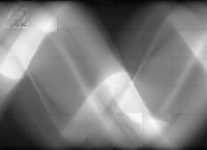
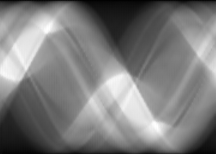
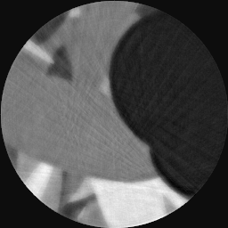

# Inpainting

## Introduction

Our goal is to perform an inpainting for computer tomographic (CT) images, to reduce the dose a patient has to undergo during an examination. We take advantage of recent developments in the architecture of neural nets and utilize so called deep convolutional generative adversarial neural nets (DCGANs) as well as an autoencoder (AE) which is trained in an adversarial fashion.

### Radon Transforms

Radon transforms are images as one obtains them from CT scans before the reconstruction. Figure 1 shows a reconstructed CT scan in the axial plane of a patient.

 
<figure>
  

  <figcpation>Fig. 1: Reconstructed CT Scan of a Liver. [<a href="#1">1</a>]</figcaption>
</figure>
  

Before the reconstruction, an image rather has the shape of many stacked sine functions. This typical appearance, as seen below, results from the detector and the x-ray source which rotate around the patient. 

 
<figure>
  

  <figcaption>Fig. 2: (Left) Section through randomly simulated ellipses. (Right) Radon transform of these ellipses.</figcaption>
</figure>
  

The shown radon transform is the result of transforming a simulated section through randomly created ellipses. For a proof of concept we stick to these simulated sections before applying the algorithm to real patient data.

### Dose Reduction
In order to reduce the radiation, a patient has to undergo, one can simply reduce the number of projections. An example of a radon transform with a reduced number of projections is shown in figure 3.

 
<figure>
  

  <figcaption>Fig. 3: Radon transform with less projections.</figcaption>
</figure>
  

To compensate for the reduced information that one obtains from such a radon transform, we test two methods for inpainting the unkown regions.

## Methods
For the inpainting we test 2 methods. The first method is based on a DCGAN architecture from [<a href="#3">3</a>], and learns to generate snippets of radon transformations from a random input. To obtain the most likely inpainting, one optimizes for the random input, as shown in [<a href="#2">2</a>]. The snippets are then put together to inpaint a whole radon transformation. The second method is based on an AE that makes use of dilated convolutions to increase the receptive field and is trained in an adversarial fashion using both, a global and a local discriminator network [<a href="#4">4</a>].

## Comparison

We can see that compared to the generative approach (Figure 4, center), the autoencoded approach (Figure 4, right) inpaints the radon transform with a global structure.

 
<figure>
  

  <figcaption>Fig. 4: (Left) Radon transform using only 25% dose. (Center) Inpainted radon transform using a DCGAN. (Right) Inpainted radon transform using an AE. </figcaption>
</figure>
  

The reconstructed images overall represent the finding of the lacking global structure for the generative inpainting, which results in ring artifacts (Figure 5, center). Both resulting reconstruction are, due to the removed information,  a little blurry.

 
<figure>
  

  <figcaption>Fig. 5: (Left) Reconstruction of original radon transform. (Center) Reconstruction using the DCGAN inpainted radon transform. (Right) Reconstruction using the AE inpainted radon transform. </figcaption>
</figure>
  

## Outlook
The AE encoder shows promising results and should further be investigated with some small adjustments, as explained [here](autoencoded_inpainting "Folder to AE Inpainting").

## Literature
[<a name="1">1</a>] [Liver CT Scan](https://upload.wikimedia.org/wikipedia/en/0/06/R_vs_L_Liver_by_CT.PNG "Link to Wikipedia")

[<a name="2">2</a>] [Semantic Image Inpainting with Deep Generative Models](https://arxiv.org/abs/1607.07539 "Link to arXiv")

[<a name="3">3</a>] [Unsupervised Representation Learning with Deep Convolutional Generative Adversarial Networks](https://arxiv.org/abs/1511.06434 "Link to arXiv")

[<a name="4">4</a>] [Globally and Locally Consistent Image Completion](http://hi.cs.waseda.ac.jp/~iizuka/projects/completion/data/completion_sig2017.pdf "Link to Their Website")
