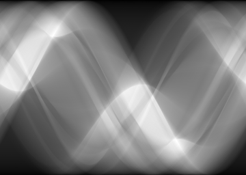

# inpainting

## Introduction

Our goal is to perform an inpainting for computer tomographic (CT) images to reduce the dose a patient has to undergo during an examination. We take advantage of recent developments in the architecture of neural nets and utilize so called deep convolutional generative adversarial neural nets (DCGANs).

### Radon Transforms

Radon transforms are images as one obtains them from CT scans before the reconstruction. The image below shows a reconstructed section in the axial plane of a patient. [<a href="#1">1</a>]

Before the reconstruction an image rather has the shape of many stacked sine functions. This typical appearance, as seen below, results from the detector and the x-ray source which rotate around the patient. 

The shown radon transform is the result of transforming a simulated section through randomly created ellipses (see below). For a proof of concept we stick to these simulated sections before applying the algorithm to real patient data.

### Dose Reduction
In order to reduce the radiation, a patient has to undergo, one can simply reduce the number of projections. An example of a radon transform with a reduced number of projections is shown below.

To compensate for the reduced information that one obtains from such a radon transform, we employ a DCGAN for inpainting the unkown regions. Please note that the masked regions of the radon transform can be barely seen on a computer screen due to aliasing.

## Methods
As proposed in [<a href="#2">2</a>], a DCGAN can be used for inpainting purposes. Since this technique works  well for small image sizes but doesnt for highly resolved images, as in our case, we simply train the algorithm on small image snippets.

## Results
The DCGAN produces radon transform snippets that can be hardly distinguished from real radon transform snippets as shown below.

We trained the net for 20 epochs.

## Literature
[<a name="1">1</a>] [Liver CT Scan](https://upload.wikimedia.org/wikipedia/en/0/06/R_vs_L_Liver_by_CT.PNG "Link to Wikipedia")

[<a name="2">2</a>] [Semantic Image Inpainting with Deep Generative Models](https://arxiv.org/abs/1607.07539 "Link to arXiv")

[3] [Unsupervised Representation Learning with Deep Convolutional Generative Adversarial Networks](https://arxiv.org/abs/1511.06434 "Link to arXiv")
