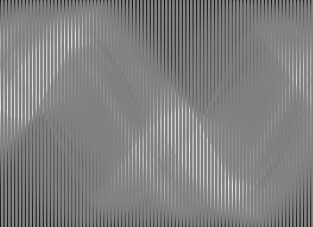

# Inpainting

## Introduction

Our goal is to perform an inpainting for computer tomographic (CT) images, to reduce the dose a patient has to undergo during an examination. We take advantage of recent developments in the architecture of neural nets and utilize so called deep convolutional generative adversarial neural nets (DCGANs).

### Radon Transforms

Radon transforms are images as one obtains them from CT scans before the reconstruction. Figure 1 shows a reconstructed CT scan in the axial plane of a patient.

 
<figure>
  

  <figcpation>Fig. 1: Reconstructed CT Scan of a Liver. [<a href="#1">1</a>]</figcaption>
</figure>
  

Before the reconstruction, an image rather has the shape of many stacked sine functions. This typical appearance, as seen below, results from the detector and the x-ray source which rotate around the patient. 

 
<figure>
  

  <figcaption>Fig. 2: (Left) Section through randomly simulated ellipses. (Right) Radon transform of these ellipses.</figcaption>
</figure>
  

The shown radon transform is the result of transforming a simulated section through randomly created ellipses. For a proof of concept we stick to these simulated sections before applying the algorithm to real patient data.

### Dose Reduction
In order to reduce the radiation, a patient has to undergo, one can simply reduce the number of projections. An example of a radon transform with a reduced number of projections is shown in figure 3.

 
<figure>
  

  <figcaption>Fig. 3: Radon transform with less projections.</figcaption>
</figure>
  

To compensate for the reduced information that one obtains from such a radon transform, we employ a DCGAN for inpainting the unkown regions. Please note that due to aliasing the masked regions of the radon transform can be barely seen on a computer screen.

## Methods
As proposed in [<a href="#2">2</a>], a DCGAN can be used for inpainting purposes. Since this technique works  well for small image sizes but doesnt for highly resolved images, as in our case, we simply train the algorithm on smaller image snippets.

## Results
The DCGAN produces radon transform snippets that can be hardly distinguished from real radon transform snippets as shown below. The network learns to model the smooth transitions in a radon transform.

 
<figure>
  

  <figcaption>Fig. 4: (Left) Snippets of size 63x63 of a radon transform. (Center) Radon transform snippets as created by the generator of the DCGAN. (Right) Evolution of the generator.</figcaption>
</figure>
  

When the inpainting is applied on overlaying snippets of the radon transform, the resulting images do neither capture global structures nor local structures quite well, as can be seen in figure 5. The quality of the inpainting does not change at higher number of projections or equally more dose.

 
<figure>
  

  <figcaption>Fig. 5: (Left) Radon transform of randomly simulated ellipses. (Right) Inpainted radon transform with 88% less dose of randomly simulated ellipses. </figcaption>
</figure>
  

## Conclusion
The presented method, as it is, does not work well to perform inpaintings on radon transformations. Other techniques have to be investigated or the inpainting based on a DCGAN has to be further developed for this kind of application. 

## Literature
[<a name="1">1</a>] [Liver CT Scan](https://upload.wikimedia.org/wikipedia/en/0/06/R_vs_L_Liver_by_CT.PNG "Link to Wikipedia")

[<a name="2">2</a>] [Semantic Image Inpainting with Deep Generative Models](https://arxiv.org/abs/1607.07539 "Link to arXiv")

[3] [Unsupervised Representation Learning with Deep Convolutional Generative Adversarial Networks](https://arxiv.org/abs/1511.06434 "Link to arXiv")
