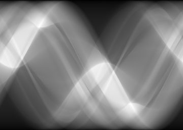
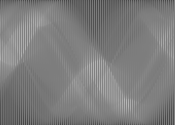
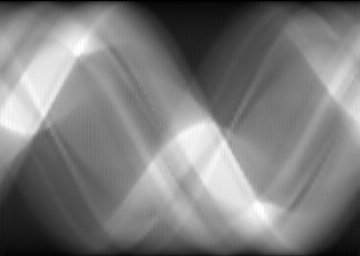
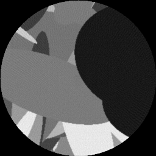
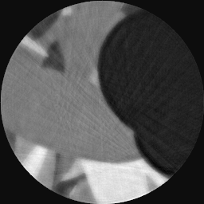

# Autoencoded Inpainting

As proposed in [<a href="#1">1</a>] an autoencoder can be used for inpainting purposes. 

## Results

 
<figure>
  

  <figcaption>Fig. 1: (Left) Radon transform of randomly simulated ellipses, using 100% dose. (Center) Radon transform using only 25% dose. (Right) Inpainted radon transform. </figcaption>
</figure>
  

 
<figure>
  

  <figcaption>Fig. 2: (Left) Reconstruction of original radon transform. (Center) Reconstruction with less projections. (Right) Reconstruction using the inpainted radon transform. </figcaption>
</figure>
  

## Conclusion

## Literature
[<a name="1">1</a>] [Globally and Locally Consistent Image Completion](http://hi.cs.waseda.ac.jp/~iizuka/projects/completion/data/completion_sig2017.pdf "Link to Their Website")
