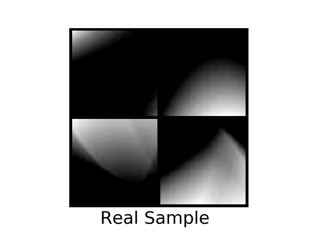
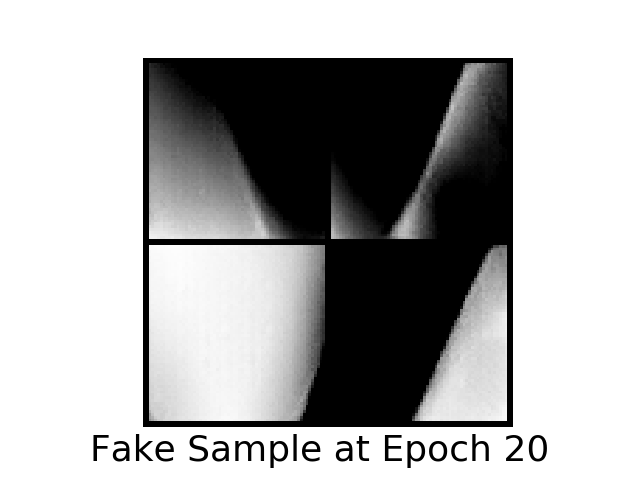
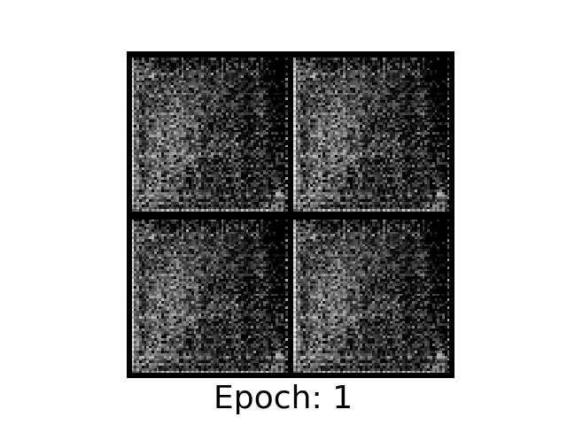
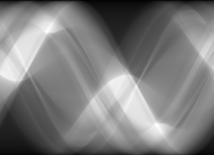
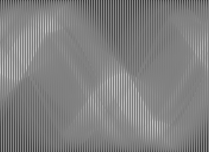
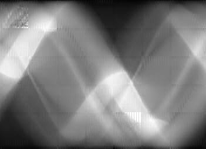
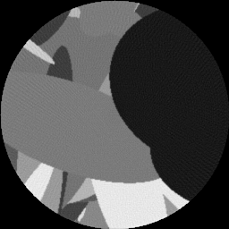
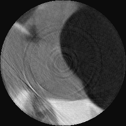

# Generative Inpainting
As proposed in [<a href="#2">2</a>], a DCGAN can be used for inpainting purposes. For the architecture of the DCGAN, we follow the recipe propsoed by [<a href="#3">3</a>]. Since this technique works  well for small image sizes but doesnt for highly resolved images, as in our case, we simply train the algorithm on smaller image snippets.

## Results
The DCGAN produces radon transform snippets that can be hardly distinguished from real radon transform snippets as shown below. The network learns to model the smooth transitions in a radon transform.

 
<figure>
  

  <figcaption>Fig. 4: (Left) Snippets of size 63x63 of a radon transform. (Center) Radon transform snippets as created by the generator of the DCGAN. (Right) Evolution of the generator.</figcaption>
</figure>
  

When the inpainting is applied on overlaying snippets of the radon transform, the resulting images do capture local structures quite well but not global structures, as can be seen in figure 5.

 
<figure>
  

  <figcaption>Fig. 5: (Left) Radon transform of randomly simulated ellipses, using 100% dose. (Center) Radon transform using only 25% dose. (Right) Inpainted radon transform. </figcaption>
</figure>
  

The reconstructed images (Figure 6) reveal that the inpainted radon transform results in blurry images and the missing of global consistency produces some ring artifacts.

 
<figure>
  

  <figcaption>Fig. 6: (Left) Reconstruction of original radon transform. (Center) Reconstruction with less projections. (Right) Reconstruction using the inpainted radon transform. </figcaption>
</figure>
  

## Conclusion
The presented method, as it is, does not work well to perform inpaintings on radon transformations. Other techniques have to be investigated to take the the global structures into account. Further, more computational power and a bigger training set could increase the resultion of the images.

## Literature
[<a name="1">1</a>] [Liver CT Scan](https://upload.wikimedia.org/wikipedia/en/0/06/R_vs_L_Liver_by_CT.PNG "Link to Wikipedia")

[<a name="2">2</a>] [Semantic Image Inpainting with Deep Generative Models](https://arxiv.org/abs/1607.07539 "Link to arXiv")

[<a name="3">3</a>] [Unsupervised Representation Learning with Deep Convolutional Generative Adversarial Networks](https://arxiv.org/abs/1511.06434 "Link to arXiv")
